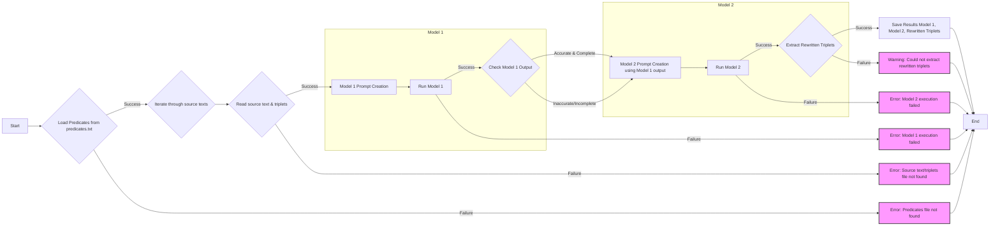

### dec 9
So I was thinking (prompted by [Eric Kansa](https://scholar.social/@ekansa/113624713408850780) and an exercise [we did in my class](https://colab.research.google.com/drive/16iPwBWc4mAKomTd1JKpZ8KzNQZ86S-hW?usp=sharing#scrollTo=rPXqnhhSd2Xp)), what if two other models evaluated the resulting triplets against the original source texts as a kind of error-checking? So [results_evaluator.py] was born. This is kinda nifty. You define two other models in there, and then turn it loose from the root of this repo. The first model looks at the source text and the triplet, suggests problems/solutions. The next model looks at the first model's response and the source text and triplets, and concurs or improves or alters.



### dec 6

Y'know, the coreference resolution largely isn't necessary, is it. The triplet extraction using the LLM implicitly handles that. Fixing all the names so that the strongest signals are present definitely helps though. So this updated version leaves my janky coreference and citation-removing code for the interested, but the pipeline skips it. I'm renaming the interim folders too so that they better describe what's inside of them. Currently testing using a local llm, smol17, to handle triplet extraction. smol17 is 1.7 gb, and I'm running it on a mac m1 mini with 16 gb ram.

So what you need to do:

**Download this repository**

You can click the green 'code' button dropdown, and select zip. Unzip somewhere sensible on your machine. Open a terminal or command prompt in that folder. I am assuming you have [anaconda or miniconda](https://docs.anaconda.com/) installed on your computer. If not, go get that first (you _can_ make an environment with python's env stuff, if you want.)

If you're feeling particularly frisky, you can `$ git clone https://github.com/shawngraham/steamroller.git` instead. I'll probably not monitor this for commits, so if you really want to suggest improvements, get in touch with me first.

**Make an environment**
```
$ conda create -n steamroller python=3.11
$ conda activate steamroller
```

**Install some stuff**
```
$ conda install -c conda-forge spacy
$ python -m spacy download en_core_web_lg
$ pip install llm
$ pip install pandas
$ pip install networkx
```

**Install some more stuff**
```
llm install llm-groq
llm keys set groq
llm aliases set themodel groq-llama3.1-70b
llm -m themodel 'is this thing on'
```

**Run the steamroller**

`$ chmod +x run_pipeline.sh`

`$ ./run_pipeline.sh`

...and yes, you need the ./ to run the shell script. 

The list of predicates are those we used in our 2023 article: 

Graham S, Yates D, El-Roby A, Brousseau C, Ellens J, McDermott C. Relationship Prediction in a Knowledge Graph Embedding Model of the Illicit Antiquities Trade. Advances in Archaeological Practice. 2023;11(2):126-138. doi:10.1017/aap.2023.1

You can modify the script 'suggest_predicates.py' and feed it a good example text of the material you're working on to see what it suggests - modify the last few lines to point to your own text. Modify the verbs in its rules etc. It's a combination of predifined synonyms and LLM. Give it a whirl, see what you think. Currently tuned towards the antiquities trade.


### first version:

I call this 'steamroller' because it's meant to take a towering edifice of unstructured text and flatten it into a knowledge graph. You define your list of predicates, and then run the pipeline. At the other end, you get a csv and a gexf file for further exploration and analysis.

The idea is that we remove ambiguity in the text by writing out personal names fully, removing citations if they exist, and then using coreference resolution to make it clear what actor is doing what. Then we use a language model to extract the triplets according to the template. The pipeline pauses after that and marks up which results don't conform to the desired list of predicates (or are not in triplet form). The user can make adjustments, then the pipeline resumes to do the final reshaping.

The results of each step are written to a new folder. The user might want to run the pipeline one step at a time, or perhaps skip a step. If you do skip a step, just make sure to adjust the code for the _next_ step so that it reads the correct folder. 

```
$ conda create -n steamroller python=3.11
$ conda activate steamroller
$ conda install -c conda-forge spacy=3.5.0
$ conda install -c conda-forge spacy-transformers
$ python -m spacy download en_core_web_trf=3.5.0
$ python -m spacy download en_core_web_lg
$ conda install -c conda-forge protobuf
$ conda install -c conda-forge sentencepiece
$ python -m pip install coreferee
$ python -m coreferee install en
$ pip install llm
$ pip install pandas
$ pip install networkx
```

...for whatever reason, all of those installs weren't working on my local machine using a requirements.txt file. Anywho. (Indeed, ultimately it turned out that I had an older version of conda that needed updating and fixing. Read those error messages carefully, folks.) 

Then, use llm [llm.datasette.io](https://llm.datasette.io) to set your model preference. You have to set an alias for whatever model you're going to use as 'themodel'. E.g:

```
llm install llm-groq
llm keys set groq
llm aliases set themodel groq-llama3.1-70b
llm -m themodel 'is this thing on'
```

Structure will be:

```
steamroller/
├── src/
│   ├── name_replacement.py
│   ├── citation_removal.py
│   ├── coref_resolution.py
│   ├── triplet_extraction.py
│   └── csv_processing.py
├── source-texts/  #(Place your input .txt files here)
├── results/
│   └── step-one/
│   └── step-two/
│   └── step-three/
│   └── step-four/
│   └── step-five/
│   └── finished/
├── requirements.txt
└── run_pipeline.sh
```

You might need to `chmod +x run_pipeline.sh`

Then: `./run_pipeline.sh`


The coreference resolution was working wonderfully in google colab, but I'm having a devil of a time making it work locally. Your milage may vary.
